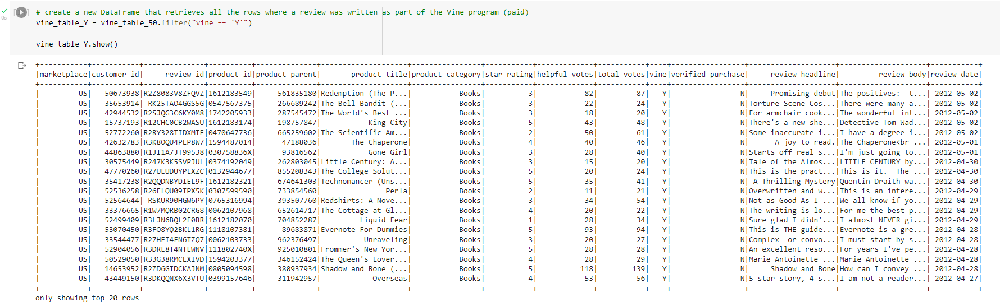
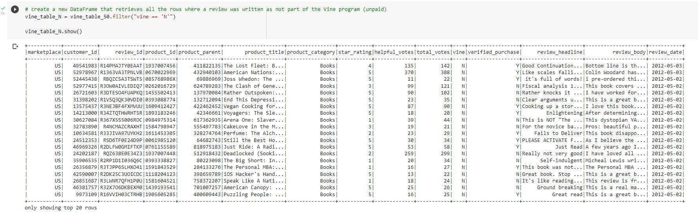
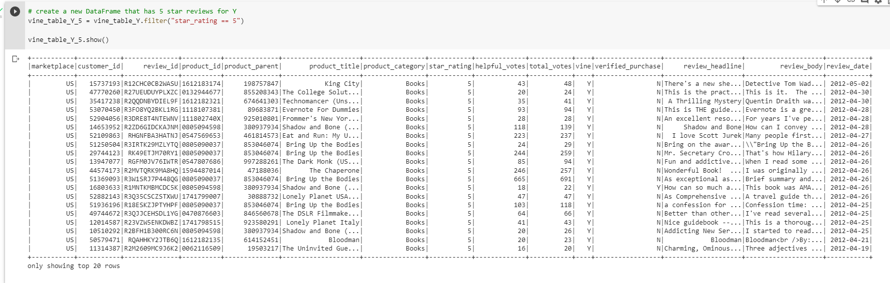
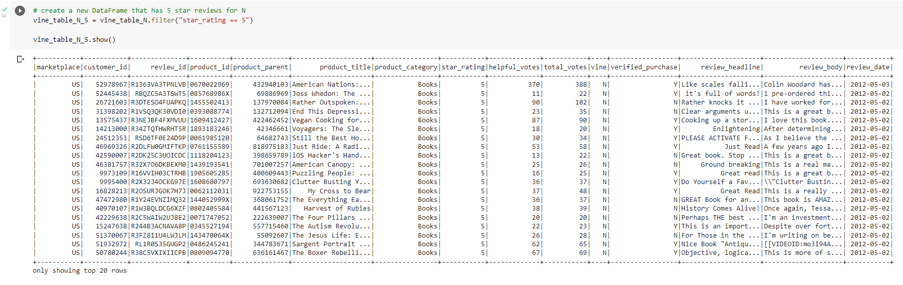
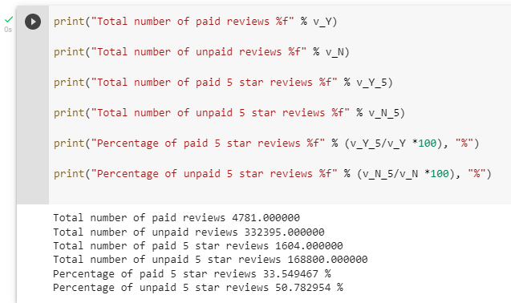
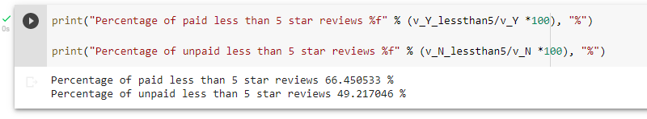

# 16-Amazon_Vine_Analysis

## Overview
The Amazon Vine program is a service that allows manufacturers and publishers to receive reviews for their products. Companies like SellBy pay a small fee to Amazon and provide products to Amazon Vine members, who are then required to publish a review. Using one of the 50 datasets provided and using PySpark to perform the ETL process to extract the dataset, transform the data, connect to an AWS RDS instance, and load the transformed data into pgAdmin.

## Results: 

### Vine reviews paid

### Vine reviews unpaid

### Vine 5 Stars reviews paid 

### Vine 5 Stars reviews paid

### Percentage of Vine reviews that were 5 stars and non-Vine reviews that were 5 stars

Percentage of paid 5 star reviews : 33.549467 % 

Percentage of unpaid 5 star reviews : 50.782954 %

## Summary: 

There is no bias in the reviews for the paid versus the unpaid programs.  The unpaid reviews percentage was higher than the paid review percentage.

## Additional Analysis

To further confirm the unbias in the paid versus the unpaid program, the above results show that the paid reviews for less than 5 stars are more that then unpaid results.